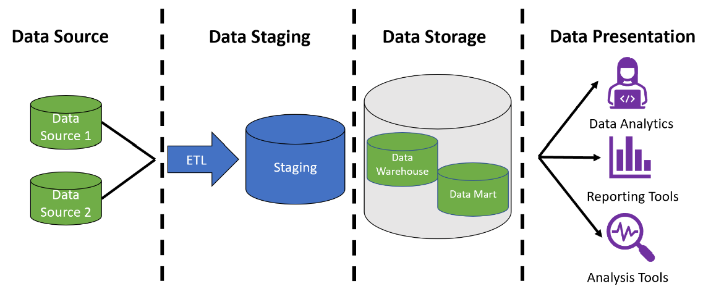
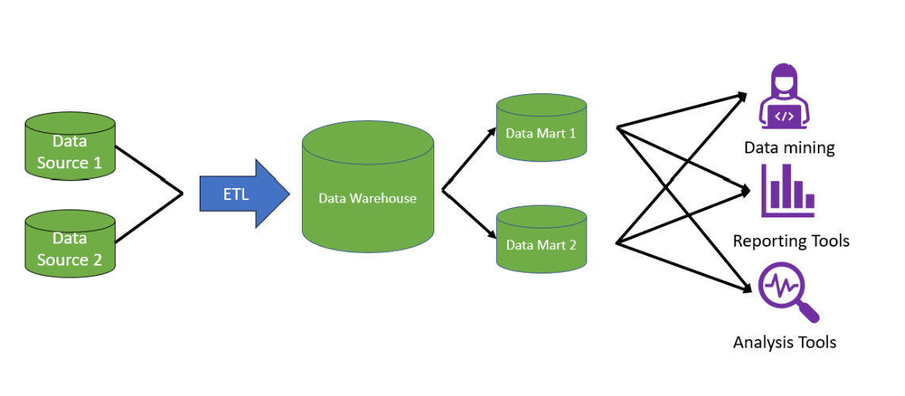
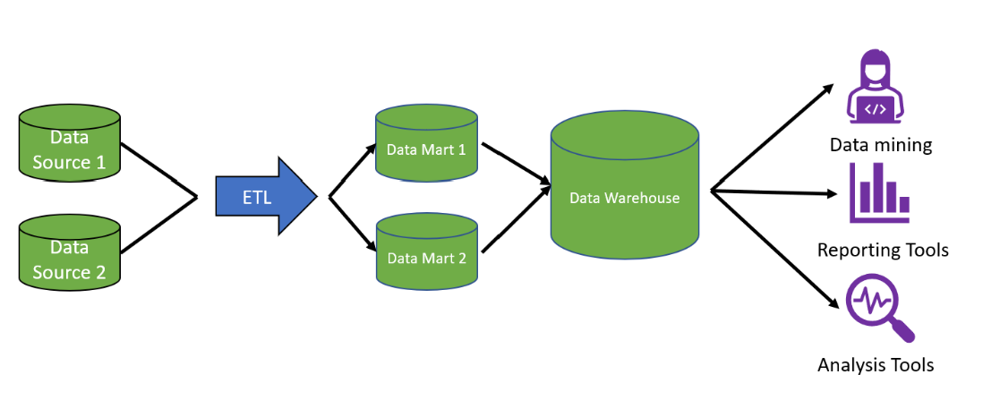
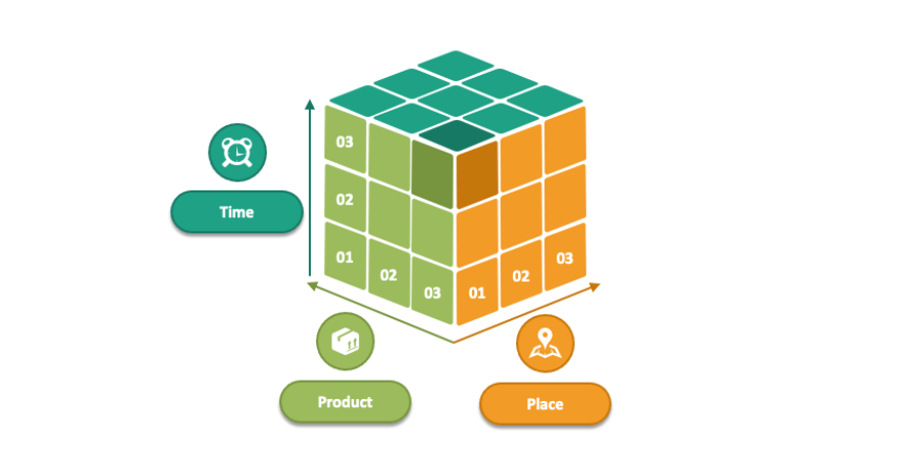
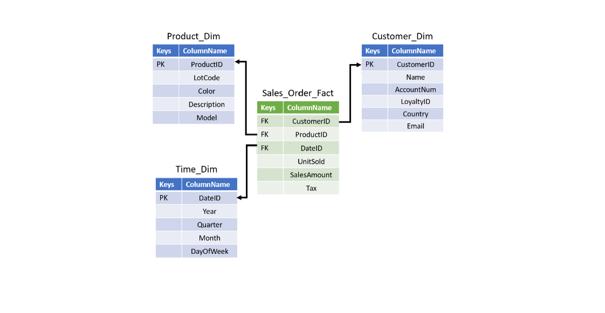
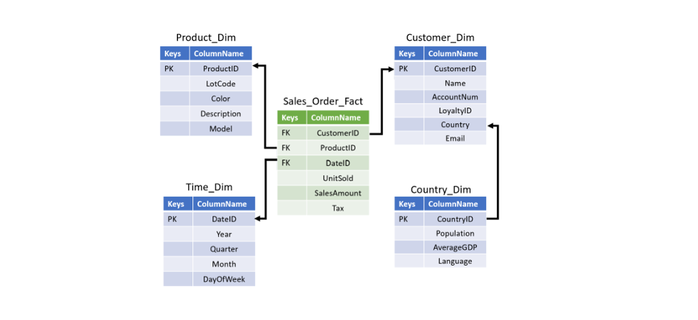
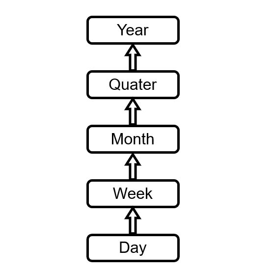
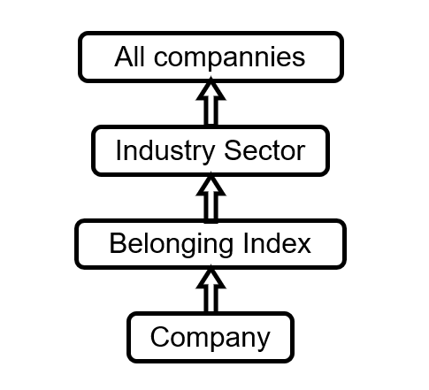

# Building a Data Warehouse for stock market analysis

## I. Introduction to Data Warehouse

### 1. What is Data Warehouse and Data Mart?

- Data Warehouse is a data management system that is designed to enable and support business intelligence activities. It helps organize, store and analyse huge amount of day to day transactional data in a systematic way. Data in Data Warehouse come from differents sources and is intergrated in a system that help increase queries and analytics performance.
- Analytical capability of Data Warehouse allow organizations to derive valuable business insights from their data to improve decision-making. These capabilities are the reason of why many companies have spent lots of money for building a Data Warehouse system.
### 2. Data Warehouse architecture
### 2.1. Overall Data Warehousing process and Layer overview

There are 4 layers that common in data warehousing process:

- Data source layer
- Data staging layer
- Data storage layer
- Data Presentation layer

The first layer is `Data source`. This layer includes all of the different sources for the data warehouse. Data sources can include different data types, such as files and databases.
Then, in `Data staging` layer, the data is extracted from source system, transformed and cleaned by applying
business rules before being loaded into data warehouse. During ETL(extract - transform - load)  process, staging tables are used to store the results between the various transformations temporarily.
The next, in `Data storage` layer, data pipelines store the staging results in the data warehouse and data marts. Depending on the
design, data from ETL process will be loaded directly into data warehouse and then into the data marts or vice versa. Finally, in `presentation` layer, users interact with the stored data. 
Queries are run in this layer to facilitate analysis. Users can use tools for automating reports or dashboard, analyzing data and direct querying.
### 2.2. Two common approach: top-down and bottom-up
There are two approachs for data warehouse architecture design: Inmon, aslo known as top-down appoach, and Kimball, also known as bottom-up.
### 2.2.1. Top-down approach
The top-down approach was popularized by Bill Inmon. Bill Inmon regarded the data warehouse as the centralized repository for all enterprise data. In this approach, the data warehouse is first created in a normalized form. Data normalization is a way of organizing data to reduce data redundancy and improve data quality.
Dimensional data marts are then created based on the warehouse model. 

### 2.2.2. Bottom-up approach
Ralph Kimball popularized the next popular data warehouse architecture, also known as the bottom-up approach. In this approach, once the data has been brought in, it is denormalized into a star or snowflake schema. A star schema is a way of storing data that makes query writing fast and straightforward. 
In the Kimball approach, the focus is on getting from data to reporting as fast as possible. This is done by first organizing and defining the data definitions of one department of the organization, placing that data into a data mart, and making it available for reporting. 
After completing one department, a new department is chosen, and the cycle repeats.

### 2.3. OLAP systems
OLAP stands for Online Analytical Processing. It is a tool for performing multidimensional analysis at high speeds on large volumes of data from a data warehouse, data mart, or some other centralized data store. 
They are optimized for analysis. In data warehousing, most organizations have data organized into different dimensions, such as sales figures by country, state, and city. Another dimension example is time, broken into years, months, and days. 
Data warehouses store data in rows and columns. OLAP systems take this two-dimensional representation of data in rows and columns and reorganize it into a multidimensional format that enables fast processing for analysis. 
This multidimensional format allows for what is commonly called "slicing and dicing" the data.

OLAP tools conceptually model the information as multidimensional cubes. Dimensions are the business users’ perspectives on which analytical trend or pattern analysis will be based.
The cubes in a DW can be stored in a multidimensional database by following either a so called Relational OLAP (ROLAP) and/or
a so-called Multidimensional OLAP (MOLAP) approach. ROLAP systems use relational databases to store data and achieve good
query performance, better scalability. It also supports frequent updates well.

### 3. Data modeling
### 3.1. What is data modeling?
Data modeling refers to how data is organized in a database into tables and how to relate those tables if we want to join them.
In Kimball approach, star and snowflake schema are 2 most common model for data warehouse.
These data models denormalize organizational data into dimensions and fact tables.
### 3.2. Fact table and dimension table
A fact table consists of measurements or metrics about main events or transactions. These are known as facts. 
Each row within the fact table captures a measurement or metric about one process transaction as well as keys to each of the related dimension tables.

Dimension tables contain attributes and characteristics that describe the data in the fact table. These characteristics are called dimensions.
By join fact table with dimension table, we will get more detail of main transactions so we can analyze data with larger set of questions.

A concept hierarchy of dimension defines a sequence of mappings from detailed concepts into higher level abstractions. Hierarchies allow the user
to start from a detailed view of data and reach to abstracted view by roll-up operation and the reverse operation is called drill-down
where the detailed data is fetched from the abstracted data. Concept hierarchy can be of total order or of partial order (aka lattice).
### 3.3. Star and snowflake schema
### 3.3.1. Star schema
A star schema is an organizational structure that uses a single fact table and one or more dimensional tables. The central table, surrounded by dimensional tables, somewhat resembles a star.
The relatively few joins needed for a star schema make queries fast and easy to use by organizational users.

### 3.3.2. Snowflake schema
A snowflake schema is similar to a star schema. However, at least one of the dimensional tables does not directly join the fact table and must be joined through another dimensional table.

### 3.4. Kimball's 4 steps data modeling
#### Step 1: Select the organizational process
The first step is to select an organizational process for which we want to create a data model, such as invoice and billing, product quality monitoring, and marketing.
#### Step 2: Declare the grain
In step 2, we decide on the grain. The grain here means the level of data stored in the fact table. It's not required, but it advised that it is the lowest level possible. Essentially, a level where we cannot split the data any further.
#### Step 3 - Identify the dimensions
In this step 3, we want to choose the dimensions that apply to each fact table row. Overall, we want to add a rich set of dimensions representing as many characteristics as possible of the fact table data. A data model may have a unique set of dimensions, but there are some that are typically used.
#### Step 4: Identify the facts
In step four, we want to identify the numeric facts that will populate each fact table row. These facts capture a measurement or metric of the process. Having members of the organization answer the question "What are we answering?" will help us identify numerical facts to include. 
Recall the purpose of the data warehouse is for reporting and analysis of the organizational process. We will need to decide on the vital numerical measures to store to answer likely questions about the process later. Finally, the fact or metric chosen should be valid at the grain selected in step two.

## II. Building Data Warehouse for stock market
### 1. Data modeling
#### 1.1. Select the organizational process
The organizational process of this project is tracking, analyzing and predicting shares price on Vietnamese stock market.
#### 1.2. Declare the grain
The level of data stored in fact table is the trading data aggregated at the end of each day of stocks on 3 exchanges Hose, Hnx and Upcom.
#### 1.3. Identify dimension table
There are many different factors that have impact on stocks price such as company operation, high-demand of some products, government policy or big events like Sea Games, World Cup, etc...Through reference to several documents, I decided to choose some follow dimensions which I think it is good for analysis workload:
  
  - ***Time:*** Time is an inevitable dimension for any data warehouse. DW stores historical data, hence present data can easily be compared with older data. Past trend analysis as well as historical
moving averages can only be calculated with data stored across time dimension. Time dimension can be defined with a concept hierarchy, starts with
each day and can extend up to lifetime of a listed
company. Concept hierarchy is to be defined on the Time dimension could be in form of Day, Week, Month, Quater and Year, etc.

    

  - ***Company Groups:*** Companies can be grouped based on sectors such as Banking and Finance, IT, Heath, etc or index such as VN30, VN100, Hnx30, etc.
This dimension will allow us to analyse comparative performance  of different index as well as different sectors, industries 

    

  - ***Rate of Interest:*** Rate of interest is also one of the facts that have impact on shares price movement.
When interest rates on loans of companies and businesses increase, the cost of debt increases, and the target profit plan in the future decreases, hence shares price may go down. Otherwise, low interest rate facilitate
companys to increase invesment, hence industry grows and shares price may go up.
  - ***Price of Crude oil:*** Another fact I have chosen is price of crude oil. Crude oil is an indispensable source of energy materials in production and business activities.
Movement on price of crude oil significantly affect to cost and profit of companies on exchanges. Therefore, tracking crude oil's price make stock market analysis more efficient.
  - ***Price of Gold:*** Gold is a precious yellow metal that has its intrinsic value to every country in the world. Most of the countries reserve large amount of gold. It is also used to pay for imported goods when exchange value of currency falls.
In times of national crisis, gross failures of large banks, depreciation in paper money value and in times of high inflation i.e. negative real interest rate, investors consider gold as a concrete asset and safe haven and like to invest in gold because often there is a little chance of getting better returns in the stock market due to a fragile economic and financial position
#### 1.4. Identify fact table
Each record of fact table contains metrics of a stock at the end of the day and dimension keys:
  
  - Stock
  - Time key
  - Company group key
  - Interest rates key
  - Crude oil price key
  - Gold price key
  - Open price
  - Close price
  - Change
  - Change percent
  - Lowest price
  - Highest price
  - Volume
  - Total trading value

After doing all these steps, here is the final data model
### 2. Implement ETL process

## III. 
